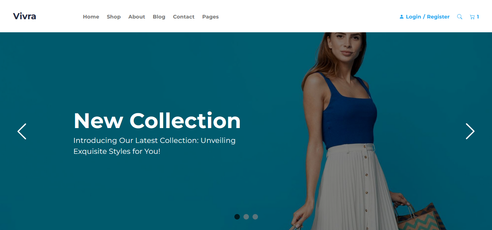

<h1 align="center">
     VIVRA - Ecommerce
</h1>

##  🕵About

In this repository you find the code for a complete Ecommerce application. 

##  👩🏾Who does

- Eduardo Rottschaefer Oliveira

Conect with me on LinkedIn! - https://www.linkedin.com/in/eduardo-rottschaefer

---
##  🧭Status do Projeto

 - ⌛ In production

---

##  🎯Project's Purpose

The main goal is to enhance my skills as a React Front End developer  implementing a modern clean code while diving in the React structure to enhance the app performance.

## ☑️Functionalities

- [x] User Login
- [x] Navigation through pages
- [x] Responsive Design
- [x] Add products to cart
- [x] Display the information from an ecommerce API
- [x] Clear and user-friendly error handling
- [x] Implemented as a single-page application (SPA) using React
- [x] Functionality tests

## 👨‍💻Technologies and Structures

- [x] ReactJS
- [x] JavaScript
- [x] HTML/CSS
- [x] Styled-Components
- [x] React Icons
- [x] Mock Service Worker
- [x] Axios
- [x] Jest
- [x] React Testing Library
- [x] Component Structure

## 🔗Deploy Link

- **Deploy Link**: [https://vivra-ecommerce.vercel.app/](https://vivra-ecommerce.vercel.app/)

---

## 🛰Running the Project

- Clone this repository on your machine with the command git clone https://github.com/Rottschaefer/vivra-ecommerce.git
- Open the project file through the terminal
- Run npm install command
- Run npm start command
- Ready! Now the application is already running on your machine :)
- Enjoy :)

---

## 📝License

This project is under the MIT license [MIT](./LICENSE).
